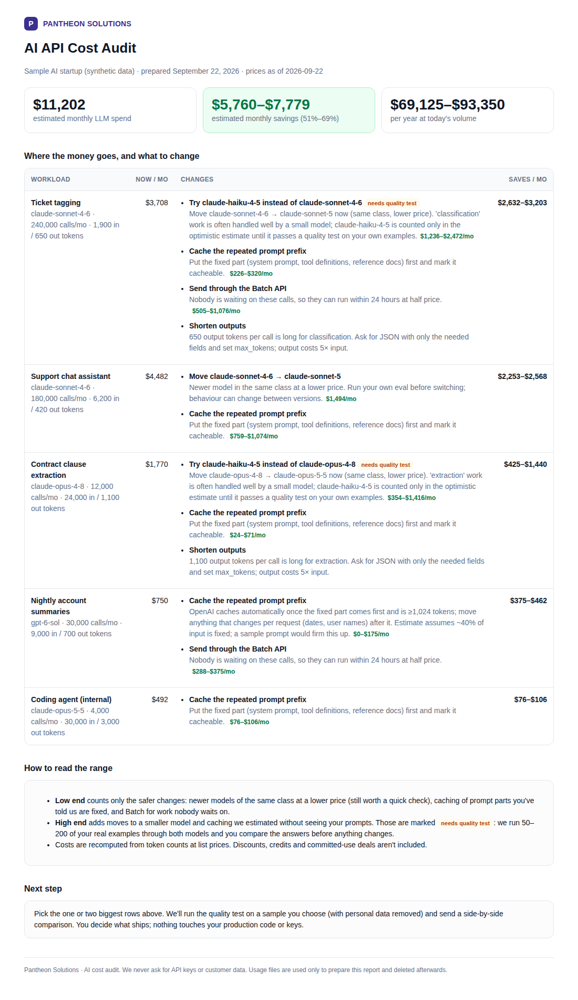

# Pantheon AI Cost Audit

Small AI startups often spend a large share of their budget on OpenAI or Anthropic API calls. Much of that goes to habits nobody revisits: every task runs on the biggest model, the same 4,000-token system prompt is paid for at full price on every call, and overnight jobs run at real-time prices.

This tool takes a startup's usage and produces a one-page report of what to change and roughly how much each change saves per month. A second script checks whether a cheaper model gives the same answers on the startup's own examples before anyone switches.



*Sample report from synthetic data in `sample/`.*

## What it checks

| Lever | When it applies | Counted in |
|---|---|---|
| **Newer, cheaper model of the same class** (e.g. Sonnet 4.6 → Sonnet 5) | Always checked | Low and high estimate |
| **Smaller model for simple work** (e.g. tagging on Sonnet → Haiku) | Task is classification, extraction, routing, etc. Never suggested for agents, code or reasoning. | High estimate only, until a quality check passes |
| **Prompt caching** | The fixed part of the prompt is ≥1,024 tokens | Low if the fixed size is known, high if estimated |
| **Batch API** (50% off) | Nobody waits on the result | Both |
| **Shorter outputs** | Long answers for simple tasks | Flagged, not priced |

Savings are applied one after another (model, then caching on the new model, then batch), so they are never double-counted and never exceed current spend.

## Run it

Plain Python 3.9+, no installs, no network access.

```bash
python3 audit.py sample/workload.csv --company "Acme AI" --out acme.html
python3 audit.py sample/anthropic_usage_export.csv --company "Acme AI"   # raw console export
python3 -m unittest test_audit
```

**Input** is either:
- a workload sheet (`templates/workload_template.csv`), with one row per feature: model, calls per month, average input and output tokens, task type, and whether it's latency-sensitive; or
- a usage export from the OpenAI or Anthropic console. Columns are detected by name. An export doesn't say what each call does, so only the safer levers are estimated from it.

**Quality check.** It runs your scrubbed sample prompts through both models with your own API key and shows the answers side by side:

```bash
ANTHROPIC_API_KEY=... python3 quality_check.py samples.jsonl --current claude-sonnet-4-6 --candidate claude-haiku-4-5
```

## Prices

Prices are in `pricing.json`, dated, with sources. Current Anthropic and OpenAI prices come from the providers' own pricing pages. Older OpenAI models are priced from a third-party tracker, used only to price existing spend, and never recommended.

## Data rules

- We never ask for API keys, and never ask for or accept end-customer data.
- Usage files are used only for the report and deleted within 30 days.
- Clients' files go in `private/`, which git ignores.

## Pilot

Pilots are free. `templates/letter_of_intent.md` (and the `.docx`) is the non-binding pilot letter.

Built by Arnav Thakur for Pantheon Solutions, with help from Claude (AI) for code and research.
